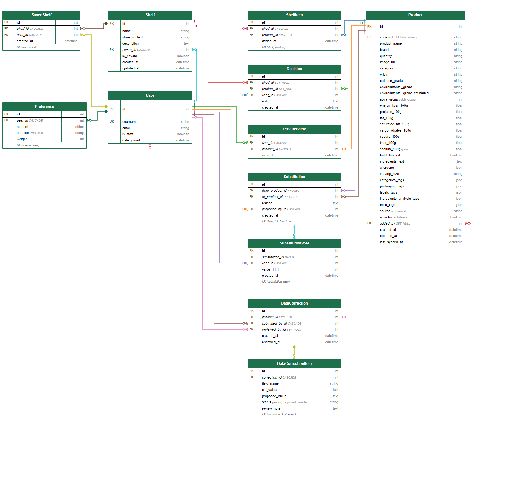
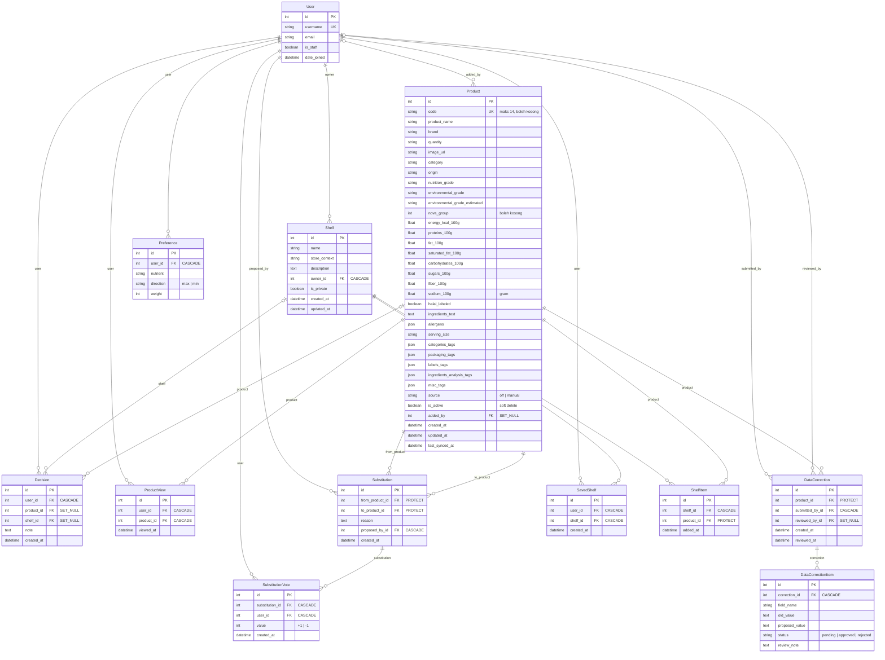

# ERD PilihYuk

Sumber: model data yang disepakati kelompok. Ada dua versi diagram yang isinya sama:

- `pilihyuk.drawio`: acuan utama. Tabel dan garis memakai elemen bawaan sidebar Entity Relation draw.io (Table dan garis relasi), jadi baris bisa disunting, ditambah, dan dihapus langsung, dan tiap garis menempel ke baris kuncinya. Buka di https://app.diagrams.net lewat File, Open from, Device.
- Blok Mermaid di bawah ini: dihasilkan dari data yang sama, tata letaknya otomatis sehingga lebih padat.

Notasi crow's foot. `||` berarti satu dan wajib, `o|` nol atau satu (kunci asing yang boleh kosong), `o{` nol atau banyak. Pada kotak entitas, `PK` kunci utama, `FK` kunci asing (teks miring, diikuti aturan hapusnya), dan `UK` kolom unik. Baris miring di dasar kotak memuat constraint gabungan.

## Aturan yang tidak terlihat dari garis

| Hal | Aturan |
|-----|--------|
| Hapus produk | Soft delete lewat `Product.is_active`. `ShelfItem`, `Substitution`, dan `DataCorrection` memakai `PROTECT`, sedangkan `Decision` memakai `SET_NULL` |
| Unik gabungan | `ShelfItem` (shelf, product), `SavedShelf` (user, shelf), `Substitution` (from, to) dengan syarat from berbeda dari to, `SubstitutionVote` (substitution, user), `DataCorrectionItem` (correction, field_name), `Preference` (user, nutrient) |
| Barcode | `Product.code` boleh kosong untuk produk manual dan disimpan sebagai `NULL`, bukan string kosong |
| Nilai yang dihitung | Jumlah suara dan jumlah simpanan shelf dihitung dengan `annotate`, tidak ada kolomnya. Status `DataCorrection` diturunkan dari item-itemnya |
| Tidak disimpan | `environmental_is_estimated` dan tautan halaman produk di Open Food Facts dihitung saat tampil |
| User | Model bawaan Django. Hanya lima kolom yang dipakai aplikasi yang digambar |
